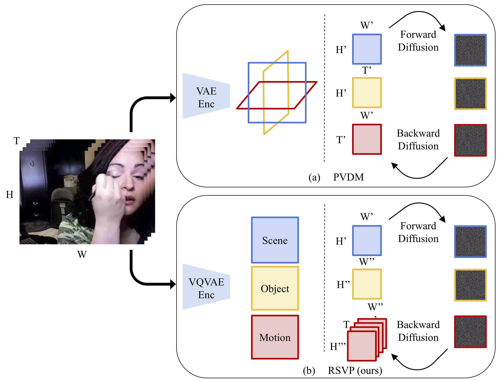
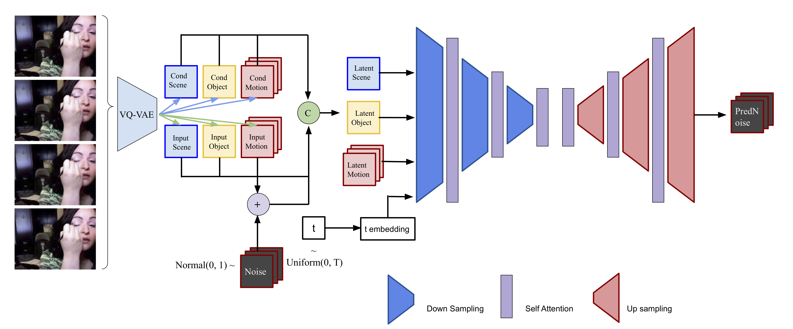

## RSVP: Revealing Semantics for Latent Diffusion based Video Prediction

CSCI 2952N Advanced Topics in Deep Learning

Yiqing Liang, 
Lingyu Ma, 
Siyang Zhang, 
Pinyuan Feng.  

Brown University

<p align="center">
     
</p>


### Abstract
Diffusion models have recently shown their promising potential in the video prediction domain, as they can capture the temporal dynamics of videos and synthesize video frames with good quality. However, challenges still remain in the computational and memory requirements of these models. Recent work utilized latent diffusion to mitigate the issue by projecting original video into a lower-dimensional latent space and training diffusion models on projected space, but no semantic prior is used during latent encoding and decoding, which compromises the consistency of predicted video frames. In this paper, we propose a two-stage framework, RSVP, that reveals meaningful semantic representations for latent diffusion to achieve inexpensive and efficient video prediction. Specifically, in the first stage, we learn to decompose videos into scene, object, and motion components; in the second stage, we train a latent diffusion model over the semantic latent space for video prediction. RSVP can fit into a single NVIDIA A40 GPU, and experimental results on the UCF-101 video dataset demonstrate the effectiveness of integrating semantic knowledge into the diffusion-based video prediction framework. We believe RSVP can serve as a promising direction to inspire and encourage further advancements in the field of video diffusion.

### Environment setup
```bash
conda create -n pvdm python=3.8 -y
conda activate pvdm
pip install torch==1.12.1+cu116 torchvision==0.13.1+cu116 torchaudio==0.12.1 --extra-index-url https://download.pytorch.org/whl/cu116
pip install natsort tqdm gdown omegaconf einops lpips pyspng tensorboard imageio av moviepy ipdb wandb omegaconf
```

### Dataset 

#### Dataset download
Currently, we do our experiments on [UCF-101](https://www.crcv.ucf.edu/data/UCF101.php). Each dataset should be placed in `/data` with the following structures below; you may change the data location directory in `tools/dataloadet.py` by adjusting the variable `data_location`.

#### UCF-101
```
UCF-101
|-- class1
    |-- video1.avi
    |-- video2.avi
    |-- ...
|-- class2
    |-- video1.avi
    |-- video2.avi
    |-- ...
    |-- ...
```

### Training

#### Latent Autoencoder

In order to train MOSO VQVAE, execute the following script:

```bash
python -m torch.distributed.launch \
--nproc_per_node=1 --nnodes=1 --node_rank=0 --master_port=10000 \
train_dist.py --opt config/mocovqvae_wcd_sCB/UCF101/MoCoVQVAEwCD_im256_16frames_id4.yaml
```

To extract tokens, execute the following script:

```bash
python -m torch.distributed.launch \
--nproc_per_node=1 --nnodes=1 --master_port=[PORT_NUMBER] \
extract_tokens.py --opt [CONFIG_FILE_DIRECTORY] \
--save_dir [SAVE_DIRECTORY] \
--ckpt [SAVED_CKPT_DIRECTORY]
```

#### Latent Diffusion model

<p align="center">
     
</p>

In order to train RSVP-M, run the following script:

```bash
 python main.py \
 --exp moso_ddpm \
 --id main \
 --data UCF-101 \
 --diffusion_config configs/moso-diffusion/base.yaml \
 --moso_config configs/moso-vqvae/test_UCF.yaml \
 --moso_checkpoint [SAVED_MOSO_VQVQE_CKPT_DIRECTORY]
```

<p align="center">
     
</p>
For more information about RSVP-S, please see details in  `siyang` branch.

In order to train RSVP-S, please checkout to `siyang` branch, and then run the following scripts:

```bash
 python train.py --epochs [NUM_EPOCHS] --batch_size [BATCH_SIZE] --save_n [SAVE_CKPT_FREQ]
```

### Evaluation
We evaluate our model on FVD and PSNR metrics.

<p align="center">
     
</p>


### Citation

```bibtex
@inproceedings{rsvp,
  title={RSVP: Revealing Semantics for Latent Diffusion based Video Prediction},
  author={Liang, Yiqing and Ma, Lingyu and Zhang, Siyang and Feng, Pinyuan},
  year={2023}
}
```

### Reference
This code is mainly built upon [MOSO](https://github.com/iva-mzsun/MOSO/tree/main) and [PVDM](https://github.com/sihyun-yu/PVDM).
